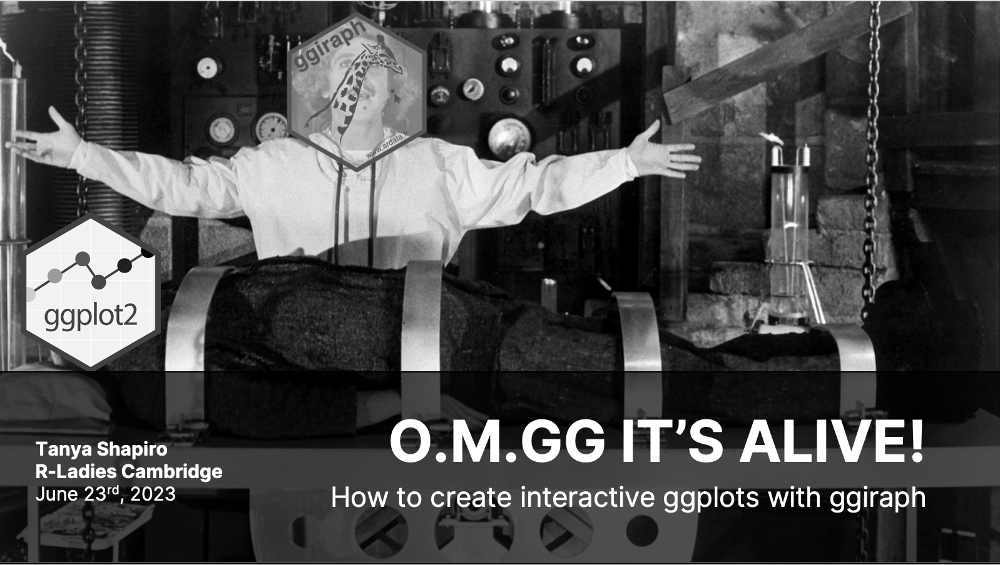

# R-Ladies Cambridge: <code>gganimate</code> Overview

I partnered with R-Ladies Cambridge to give a quick lunch and learn session, reviewing the basics of <code>gganimate</code> - a package that let's users convert static ggplot visuals into interactive plots. 

